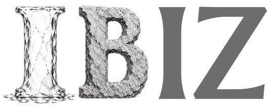

# RadarCLIP

Contrastive learning for ice-penetrating radar (IPR) data.

# Data

Blankenship, D.D., Roberts, J.L., Greenbaum, J.S., Young, D.A., Van Ommen, T., Le Meur, E. and Beem, L.H. (2018) EAGLE/ICECAP II RADARGRAMS, Ver. 1, Australian Antarctic Data Centre - doi:10.26179/5bcff4afc287d, Accessed: 2026-07-14
[link to AADC](https://data.aad.gov.au/metadata/AAS_4346_EAGLE_ICECAP_LEVEL2_RADAR_DATA)

Roberts, J.L., Blankenship, D.D., Greenbaum, J.S., Beem, L.H., Kempf, S.D., Young, D.A., Richter, T.G., Van Ommen, T. and Le Meur, E. (2025) EAGLE/ICECAP II - geophysical observations (surface and bed elevation, ice thickness, gravity disturbance and magnetic anomalies) - 2015-2018, Ver. 3, Australian Antarctic Data Centre - doi:10.26179/11md-a816, Accessed: 2026-07-14 
[link to AADC](https://data.aad.gov.au/metadata/AAS_4346_EAGLE_ICECAP_LEVEL2_AEROGEOPHYSICS)

# Questions for radioglaciology experts
- How is the offset on top determined and what value is used during preprocessing? (L1B -> L2)
- Is the "ice surface" the surface of the lower, compacted ice or the surface of the firn (surface pick coincides with strongest signal but not upper signal)
- low gain/ high gain

# Known issues
2016: 156 radargrams
ER2HI1B_2017023_ICP8_JKB2r_F07T08a_000 (no match at all)
ER2HI1B_2017027_KNX_JKB2r_Y27a_001 (one missing)